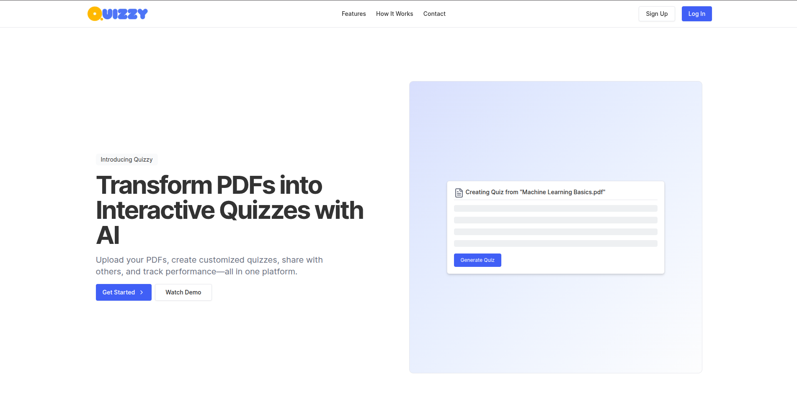

# 📘 Quizzy – Intelligent Quiz Generation Platform

**Quizzy** is an advanced, AI-powered platform for creating and managing quizzes from PDF documents. It unifies two backend systems into a single seamless frontend experience, enabling users to generate MCQs using traditional text analysis or interactively through Retrieval-Augmented Generation (RAG) with OpenAI.

---

## 🧩 Project Structure

```bash
Quizzy/
├── frontend/                 # Next.js + Tailwind UI
│   └── README.md             # Frontend setup and usage
├── quiz-generator-api/      # Backend 1: PDF to MCQ generator
│   └── README.md             # FastAPI + MySQL backend details
├── rag-quiz-system/         # Backend 2: RAG-based chat and quiz gen
│   └── README.md             # FastAPI + Redis + OpenAI backend details
└── README.md                 # ← You are here
```

---



## 🚀 Key Features

- 📄 Upload and manage PDFs
- 🧠 Generate quizzes using:

  - Traditional MCQ generation (from full PDF text)
  - RAG (Retrieval-Augmented Generation) with GPT

- 🤖 Chat with PDF content
- 📥 Download quizzes and answers
- 🔒 User authentication (JWT-based)
- 📡 Real-time job status and webhook notifications

---

## 🛠️ Tech Stack

| Layer         | Technology                                        |
| ------------- | ------------------------------------------------- |
| Frontend      | Next.js, Tailwind CSS, React Query, Axios         |
| Backend (MCQ) | FastAPI, MySQL, JWT, PDF parsing                  |
| Backend (RAG) | FastAPI, Redis Queue, ChromaDB, OpenAI, LangChain |
| Auth          | JWT tokens                                        |
| Queue         | Redis + RQ (Redis Queue)                          |

---

## 🔧 Installation Overview

### 1. Clone the Monorepo

```bash
git clone <monorepo-url>
cd Quizzy
```

### 2. Setup Backend APIs

#### ▶️ Quiz Generator API

```bash
cd quiz-generator-api
python -m venv venv
source venv/bin/activate
pip install -r requirements.txt

# Configure DB in `.env`
# Create MySQL DB: quiz_generator

uvicorn app.main:app --reload
```

> API available at: `http://localhost:8001` > [Full backend docs here](quiz-generator-api/README.md)

---

#### ▶️ RAG Quiz System

```bash
cd rag-quiz-system
python -m venv venv
source venv/bin/activate
pip install -r requirements.txt

# Start Redis separately
uvicorn app.main:app --reload
python worker.py  # In another terminal
```

> API available at: `http://localhost:8000` > [Full backend docs here](rag-quiz-system/README.md)

---

### 3. Setup Frontend

```bash
cd frontend
npm install
```

Create a `.env.local` file:

```env
NEXT_PUBLIC_API_BASE_URL=http://localhost:8000           # RAG system
NEXT_PUBLIC_QUIZ_GEN_API_URL=http://localhost:8001       # Quiz Generator API
```

Start the dev server:

```bash
npm run dev
```

Frontend will run on: `http://localhost:3000`

---

## 📚 Use Cases

| Use Case                   | System             |
| -------------------------- | ------------------ |
| Register/Login             | Quiz Generator API |
| Upload PDF & Generate MCQs | Quiz Generator API |
| Chat with PDF              | RAG Quiz System    |
| Topic/Page-based Quiz      | RAG Quiz System    |
| Job Queue + Webhooks       | RAG Quiz System    |
| View, Download Quizzes     | Frontend           |
